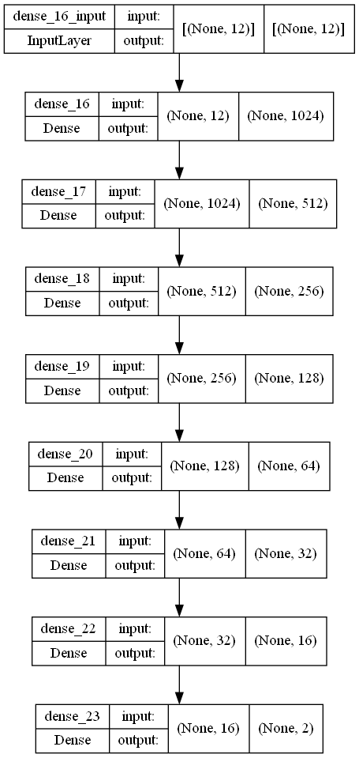

# Mushroom Classifier

This is a simple Kaggle Data Science Project which we will construct a classifier of mushrooms using features provided by kaggle dataset. We have features like a odor, type of rings on mushrooms and shape. Then, we will construct two models, first based on XGboost and second based on Neural Networks like a classifier. 

Spoiler: Both models reach 100% accuracy and 99.9% of f1 score. We will discuss this, but probabily there is some deterministic rules that will lead us to classifier all mushrooms.

# Road map

Lets create a road map to our notebook! All Data science project need to build a road map like here.

- [x] Data adquiere
- [x] Data analysis
- [x] Pre-processing
- [x] Model Construct
    - [x] XGboost
    - [x] MLP
- [] Create pipeline and deploy it

Each step in this road map will discuss and we use good techniques wich will util tools in many others projects. Then, lets solve each step in our road map and lets classifier all mushrooms.